<p align="center">
  
</p>

```
 █████╗ ██████╗  █████╗  ██████╗██╗  ██╗███████╗
██╔══██╗██╔══██╗██╔══██╗██╔════╝██║  ██║██╔════╝
███████║██████╔╝███████║██║     ███████║█████╗
██╔══██║██╔═══╝ ██╔══██║██║     ██╔══██║██╔══╝
██║  ██║██║     ██║  ██║╚██████╗██║  ██║███████╗
╚═╝  ╚═╝╚═╝     ╚═╝  ╚═╝ ╚═════╝╚═╝  ╚═╝╚══════╝

        Hardening Audit Tools
        Red Team / Blue Team Portfolio Project
```

<div align="center">


</div>

---

> Alat audit keamanan berbasis Python untuk mendeteksi miskonfigurasi pada Apache HTTP Server.
> Dirancang sebagai proyek portofolio **Red Team / Blue Team** dengan output laporan HTML yang profesional.
> **Project ini terbuka untuk dikembangkan** — kontribusi, ide, dan pull request sangat disambut.

---

## Daftar Isi

- [Gambaran Umum](#gambaran-umum)
- [Fitur](#fitur)
- [Daftar Pemeriksaan](#daftar-pemeriksaan)
- [Persyaratan](#persyaratan)
- [Instalasi](#instalasi)
- [Cara Penggunaan](#cara-penggunaan)
- [Alur Kerja yang Direkomendasikan](#alur-kerja-yang-direkomendasikan)
- [Output](#output)
- [Web Interface (XAMPP)](#web-interface-xampp)
- [Kelebihan dan Kekurangan](#kelebihan-dan-kekurangan)
- [Referensi Standar](#referensi-standar)
- [Kontribusi](#kontribusi)
- [License](#license)
- [Disclaimer](#disclaimer)

---

## Gambaran Umum

Tool ini melakukan audit otomatis terhadap file konfigurasi Apache (`httpd.conf` / `apache2.conf`) dan secara opsional melakukan pemeriksaan langsung ke server HTTP target. Setiap temuan dikategorikan berdasarkan tingkat keparahan, dipetakan ke framework **MITRE ATT&CK**, dan disajikan dalam dashboard HTML yang dapat dibagikan.

```
apache_audit.py
    ├── Analisis file config (.conf)
    ├── Pemeriksaan filesystem (permission file)
    └── Pemeriksaan HTTP live (opsional, jika --url diberikan)
```

---

## Fitur

- **22 pemeriksaan keamanan** mencakup konfigurasi, TLS, header HTTP, dan filesystem
- **Sistem penilaian** dengan skor 0–100 dan grade A–D
- **Pemetaan MITRE ATT&CK** pada setiap temuan
- **Output terminal berwarna** untuk pembacaan cepat
- **Laporan HTML** dengan dashboard interaktif, filter status, dan donut score
- **Output JSON** untuk integrasi dengan pipeline CI/CD atau SIEM
- **Auto-detect config** pada path standar Linux
- **Tidak memerlukan library eksternal** — hanya Python standard library
- **Web interface via PHP** untuk integrasi dengan XAMPP/localhost

---

## Daftar Pemeriksaan

| ID | Nama Pemeriksaan | Severity | Referensi |
|---|---|---|---|
| APT-001 | ServerTokens | HIGH | CIS Apache 2.4 §2.1 |
| APT-002 | ServerSignature | MEDIUM | CIS Apache 2.4 §2.2 |
| APT-003 | Directory Listing (Options Indexes) | HIGH | OWASP A05 |
| APT-004 | HTTP TRACE Method | MEDIUM | CVE-2004-2320 |
| APT-005 | ETag Inode Disclosure | LOW | CIS Apache 2.4 §3.4 |
| APT-006 | Timeout (Slowloris DoS) | MEDIUM | MITRE T1499 |
| APT-007 | LimitRequestBody | MEDIUM | MITRE T1499 |
| APT-008 | FollowSymLinks | HIGH | MITRE T1083 |
| APT-009 | AllowOverride | MEDIUM | MITRE T1574 |
| APT-010 | ModSecurity WAF | CRITICAL | OWASP CRS |
| APT-011 | SSL/TLS Protocol Version | CRITICAL | CVE-2014-3566 |
| APT-012 | HSTS Header | HIGH | MITRE T1557 |
| APT-013 | Security Headers (5 header) | HIGH | OWASP Secure Headers |
| APT-014 | mod_status Exposure | MEDIUM | MITRE T1592 |
| APT-015 | PHP Version Exposure | MEDIUM | MITRE T1592 |
| APT-016 | HTTP Methods (OPTIONS) | MEDIUM | MITRE T1059 |
| APT-017 | Server Header Live Check | HIGH | MITRE T1592.002 |
| APT-018 | Directory Listing via HTTP | HIGH | MITRE T1083 |
| APT-019 | Clickjacking Protection | MEDIUM | MITRE T1185 |
| APT-020 | TLS Live Negotiation | CRITICAL | MITRE T1557 |
| APT-021 | Default Apache Page | MEDIUM | MITRE T1592 |
| APT-022 | File Permission | HIGH | MITRE T1222 |

> Pemeriksaan APT-016 hingga APT-021 hanya aktif jika parameter `--url` diberikan.

---

## Persyaratan

- Python 3.8 atau lebih baru
- Tidak memerlukan instalasi library tambahan (menggunakan standard library)
- Akses baca terhadap file konfigurasi Apache

Verifikasi Python:
```bash
python --version
# atau
python3 --version
```

---

## Instalasi

**1. Clone atau download file**

```bash
# Jika menggunakan git
git clone https://github.com/tanzz1337/ApacheAudit.git
cd ApacheAudit

# Atau cukup download ApacheAudit.py secara langsung
```

**2. Tidak ada dependensi yang perlu diinstall**

Tool ini hanya menggunakan Python standard library sehingga langsung dapat dijalankan.

**3. Struktur folder**

```
project/
├── apache_audit.py     # Tool utama
├── index.php           # Web interface (opsional, untuk XAMPP)
├── README.md
└── reports/            # Folder output laporan (dibuat otomatis)
```

---

## Cara Penggunaan

### Penggunaan Dasar

```bash
# Scan dengan menunjuk file config secara langsung
python apache_audit.py -c httpd.conf -o laporan.html
```

### Semua Opsi Parameter

| Parameter | Singkat | Keterangan |
|---|---|---|
| `--config` | `-c` | Path ke file konfigurasi Apache |
| `--url` | `-u` | URL target untuk pemeriksaan HTTP live |
| `--output` | `-o` | Nama file output (`.html` atau `.json`) |

### Contoh Penggunaan

```bash
# Scan config XAMPP di Windows
python apache_audit.py -c C:\xampp\apache\conf\httpd.conf -o hasil.html

# Scan config Ubuntu/Debian
python apache_audit.py -c /etc/apache2/apache2.conf -o laporan.html

# Scan config CentOS/RHEL
python apache_audit.py -c /etc/httpd/conf/httpd.conf -o laporan.html

# Scan config + pemeriksaan HTTP live
python apache_audit.py -c httpd.conf -u http://192.168.1.10 -o full_audit.html

# Export ke JSON (untuk integrasi pipeline/SIEM)
python apache_audit.py -c httpd.conf -o hasil.json
```

### Catatan Ekstensi Output

- Jika nama output diakhiri `.json` → otomatis export ke format JSON
- Selain itu → selalu export ke format HTML

---

## Alur Kerja yang Direkomendasikan

Audit sebaiknya dilakukan dari mesin auditor, **bukan langsung di server target**.

```
[Server Target]                    [Mesin Auditor]
      |                                   |
      |  1. Download file config          |
      |  ──────────────────────────────►  |
      |                                   |
      |                      2. Jalankan audit
      |                      python apache_audit.py
      |                         -c httpd.conf
      |                         -o laporan.html
      |                                   |
      |                      3. Analisis laporan.html
      |                      4. Buat remediation plan
      |                                   |
      |  5. Terapkan perbaikan            |
      |  ◄──────────────────────────────  |
      |                                   |
      |  6. Download ulang config         |
      |  ──────────────────────────────►  |
      |                      7. Audit ulang untuk verifikasi
```

**Cara download file config dari server remote:**

```bash
# Via SCP (Linux/Mac)
scp user@192.168.1.10:/etc/apache2/apache2.conf ./httpd.conf

# Via cPanel
# File Manager → /etc/apache2/ → Download

# XAMPP Windows (lokal)
# Langsung ambil dari: C:\xampp\apache\conf\httpd.conf
```

---

## Output

### Terminal

Setiap pemeriksaan ditampilkan secara real-time di terminal dengan warna:

```
  [OK]   [HIGH] ServerTokens set to Prod
  [FAIL] [CRIT] ModSecurity WAF not detected
         -> No WAF detected. SQLi, XSS, and other attacks are unfiltered.
  [WARN] [MED]  Timeout too high (300s)
         -> High timeout increases Slowloris DoS exposure.
```

### Dashboard HTML

Laporan HTML berisi:
- **Score ring** — skor keseluruhan 0–100 dengan grade A/B/C/D
- **Kartu statistik** — total, passed, failed, warning
- **Breakdown severity** — Critical, High, Medium, Low
- **Tabel temuan** — dapat difilter per status (All / Failed / Warning / Passed)
- **Kolom rekomendasi** — langkah perbaikan untuk setiap temuan
  


### JSON

Format JSON cocok untuk integrasi dengan:
- Pipeline CI/CD (GitHub Actions, GitLab CI)
- SIEM (Splunk, Wazuh, ELK Stack)
- Sistem ticketing (Jira, Trello)

```json
{
  "tool": "Apache Hardening Audit Tool v1.0",
  "generated": "2025-02-25T14:30:00",
  "score": 45,
  "max_score": 100,
  "percentage": 45,
  "findings": [
    {
      "id": "APT-001",
      "title": "ServerTokens misconfigured",
      "status": "FAIL",
      "severity": "HIGH",
      "description": "...",
      "recommendation": "...",
      "mitre": "T1592.002"
    }
  ]
}
```

---

## Web Interface (XAMPP)

Tersedia file `index.php` untuk menjalankan tool melalui browser di localhost.

**Setup:**

```
C:\xampp\htdocs\audit\
    ├── index.php
    └── apache_audit.py
```

Akses melalui browser: `http://localhost/audit/`

**Fitur web interface:**
- Status otomatis: cek Python, script, dan config XAMPP
- Mode **Scan Lokal** — langsung scan `httpd.conf` XAMPP tanpa upload
- Mode **Upload Config** — upload file `.conf` dari server lain
- URL opsional untuk pemeriksaan HTTP live
- Hasil tampil langsung di halaman yang sama

> **Catatan keamanan:** Web interface hanya untuk digunakan di jaringan lokal / localhost. Jangan expose ke internet.

---

## Kelebihan dan Kekurangan

### Kelebihan

**Teknis:**
- Tidak memerlukan instalasi dependensi eksternal sama sekali
- Berjalan lintas platform: Windows, Linux, macOS
- Output HTML mandiri (satu file, tidak perlu koneksi internet untuk membuka)
- Pemetaan MITRE ATT&CK membantu memahami konteks ancaman setiap temuan
- Sistem scoring memberikan gambaran kuantitatif tingkat keamanan


### Kekurangan

**Keterbatasan Teknis:**
- Analisis config menggunakan regex sederhana — tidak memahami hierarki blok `<Directory>`, `<VirtualHost>`, atau `<IfModule>` secara mendalam
- Tidak mendukung parsing file yang di-`Include` dari config utama secara otomatis
- Pemeriksaan HTTP live sangat dasar — tidak setara dengan scanner profesional seperti Nikto atau OWASP ZAP
- Tidak mendeteksi miskonfigurasi di level modul Apache yang kompleks (mod_rewrite, mod_proxy, dll.)
- Tidak dapat mendeteksi kelemahan runtime seperti race condition atau logic flaw

**Keterbatasan Cakupan:**
- Tidak mencakup audit sistem operasi (hardening OS, firewall, SELinux/AppArmor)
- Tidak memeriksa keamanan aplikasi web yang berjalan di atas Apache
- Tidak mendukung format konfigurasi Nginx atau IIS

**Keterbatasan Penggunaan:**
- Memerlukan akses baca langsung ke file config (tidak bisa audit remote tanpa copy file terlebih dahulu)
- False positive mungkin terjadi jika konfigurasi tersebar di banyak file include
- Belum memiliki fitur pembanding hasil audit sebelum dan sesudah hardening

---

## Referensi Standar

Tool ini mengacu pada standar dan panduan keamanan berikut:

| Standar | Keterangan |
|---|---|
| CIS Apache HTTP Server 2.4 Benchmark | Panduan konfigurasi baseline keamanan Apache |
| OWASP Top 10 2021 | Referensi risiko keamanan aplikasi web |
| MITRE ATT&CK Framework | Pemetaan teknik serangan ke setiap temuan |
| NIST SP 800-52 Rev. 2 | Panduan implementasi TLS |
| Mozilla SSL Configuration Generator | Referensi konfigurasi TLS modern |

---

## Kontribusi

Project ini **terbuka untuk dikembangkan**. Segala bentuk kontribusi sangat disambut, baik itu bug fix, fitur baru, perbaikan dokumentasi, maupun ide pengembangan.

### Cara Berkontribusi

```
1. Fork repository ini
2. Buat branch baru
   git checkout -b fitur/nama-fitur-kamu

3. Commit perubahan
   git commit -m "feat: tambahkan pemeriksaan X"

4. Push ke branch kamu
   git push origin fitur/nama-fitur-kamu

5. Buat Pull Request
```

### Ide Pengembangan yang Bisa Dikerjakan

Berikut beberapa area yang terbuka untuk dikontribusikan:

**Pemeriksaan Baru:**
- Audit konfigurasi `mod_rewrite` dan `mod_proxy`
- Deteksi default credential pada modul Apache
- Pemeriksaan konfigurasi `mod_evasive` untuk proteksi DDoS
- Audit permission pada file `.htaccess` secara rekursif
- Dukungan parsing file `Include` dan `IncludeOptional`

**Peningkatan Tool:**
- Parser konfigurasi berbasis blok (`<Directory>`, `<VirtualHost>`, `<IfModule>`) yang lebih akurat
- Fitur diff/perbandingan dua hasil audit (sebelum dan sesudah hardening)
- Mode `--fix` untuk auto-apply rekomendasi sederhana
- Dukungan konfigurasi Nginx sebagai target tambahan
- Integrasi dengan Wazuh / Splunk via syslog output

**Interface & Integrasi:**
- CLI progress bar yang lebih informatif
- Export ke format PDF
- GitHub Actions workflow untuk audit otomatis saat push
- Notifikasi via Telegram / Slack jika ditemukan temuan CRITICAL

---

## License

```
MIT License

Copyright (c) 2025 Apache Hardening Audit Tool Contributors

Permission is hereby granted, free of charge, to any person obtaining a copy
of this software and associated documentation files (the "Software"), to deal
in the Software without restriction, including without limitation the rights
to use, copy, modify, merge, publish, distribute, sublicense, and/or sell
copies of the Software, and to permit persons to whom the Software is
furnished to do so, subject to the following conditions:

The above copyright notice and this permission notice shall be included in all
copies or substantial portions of the Software.

THE SOFTWARE IS PROVIDED "AS IS", WITHOUT WARRANTY OF ANY KIND, EXPRESS OR
IMPLIED, INCLUDING BUT NOT LIMITED TO THE WARRANTIES OF MERCHANTABILITY,
FITNESS FOR A PARTICULAR PURPOSE AND NONINFRINGEMENT.
```

---

## Disclaimer

Tool ini dibuat **semata-mata untuk tujuan edukasi, audit internal, dan pengembangan portofolio keamanan siber**.

- Hanya gunakan tool ini pada sistem yang Anda miliki atau telah mendapatkan izin tertulis untuk diaudit
- Penulis tidak bertanggung jawab atas penyalahgunaan tool ini
- Hasil audit bersifat indikatif dan tidak menggantikan penetration testing profesional secara menyeluruh

---

<div align="center">

**Apache Hardening Audit Tool**

Red Team / Blue Team Portfolio Project — MIT License

*Dibuat untuk belajar, terbuka untuk berkembang.*

</div>
